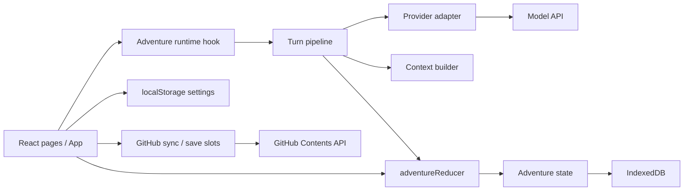

# Application architecture

This document describes the implemented AI Story Teller app. It is a code map for contributors; the more detailed feature rules live in [FEATURES.md](../FEATURES.md) and [AGENTS.md](../AGENTS.md). The backend documents in this folder are proposals, not the current runtime.

## System boundary

AI Story Teller is a React 19 and TypeScript single page application built by Vite. The production artifact is static HTML, JavaScript, and CSS served by GitHub Pages. There is no application server or database service. The browser stores adventures in IndexedDB, stores small device settings in localStorage, and makes HTTPS requests directly to the selected model provider and, when enabled, the GitHub API.

## Ownership and source map

| Concern | Source | Responsibility |
| --- | --- | --- |
| Application shell | `src/App.tsx`, `src/pages/*` | Navigation, page composition, current adventure, settings, and user actions |
| Domain model | `src/types/adventure.ts` | Adventure, context, proposal, trigger, provider, and action types |
| State transitions | `src/state/adventureReducer.ts`, `src/state/defaults.ts` | Immutable action handling, defaults, old save normalization |
| Turn orchestration | `src/hooks/useAdventureRuntime.ts`, `src/state/turnPipeline.ts` | Submit, continue, regenerate, background jobs, and saving |
| Prompt construction | `src/contextBuilder/contextBuilder.ts` | Context eligibility, ordered sections, budget cuts, final provider messages |
| Model transport | `src/providers/openAICompatible.ts`, `src/providers/backgroundProvider.ts` | Direct browser requests, provider options, background model selection |
| Rules and memory | `src/triggers/*`, `src/memory/*` | Deterministic triggers, semantic evaluation, memory proposals, validation, update boundaries |
| Persistence | `src/db/adventureDb.ts`, `src/hooks/useAdventureAutosave.ts` | IndexedDB reads and writes, delayed autosave |
| Remote saves | `src/sync/*`, `src/hooks/useCloudSyncController.ts`, `src/hooks/useGitHubSaves.ts` | Optional GitHub library sync and save slots |
| Import and export | `src/pages/ImportExportPage.tsx`, `src/importers/*` | JSON backups and AI Dungeon source parsing |

## Adventure state and persistence

An `Adventure` owns its transcript (`messages`), components, Story Cards, Brains, trigger rules, runtime state, token settings, and provider preferences. `activeState` contains the turn counter, logs, pending memory proposals, one turn notes, and queued updates. Shared types live in `src/types/adventure.ts`.

`adventureReducer(state, action)` is the mutation boundary. Pages dispatch typed actions; the turn pipeline folds actions through the same reducer. Factories and `normalizeAdventure` in `src/state/defaults.ts` supply defaults and migrate older saved shapes when they are read.

`src/db/adventureDb.ts` stores each adventure by ID in the browser's `ai-story-teller` IndexedDB database. The autosave hook writes after a 350 ms debounce; the runtime also saves completed turns and some background updates immediately. Library operations create, open, duplicate, import, and delete adventures. The complete Chronicle remains in `messages`; only a recent window is sent to the model.

`src/hooks/useLocalStorage.ts` stores provider presets, the active preset, UI preferences, GitHub configuration, and global adventure settings. The active API key comes from the browser setting. `sanitizeAdventureForPersistence` removes `modelConfig.apiKey` and `sessionId` before IndexedDB writes. Export and GitHub save paths also strip the adventure's embedded API key. Treat the localStorage token and API key as device secrets: the browser uses them directly when calling external services.

## A story turn

The normal submit flow starts in `useAdventureRuntime.submitTurn` and calls `runTurnPipeline`:

1. Flush queued background actions into the adventure before building the next prompt. A continuity challenge phrase can set a one turn challenge flag.
2. Add the player's message through the reducer, then run synchronous input trigger rules.
3. Call `buildContext` with the updated state. The runtime shows this result in Context Preview and sends its `messages` to the provider.
4. The provider adapter calls the configured model endpoint. The runtime limits output tokens from the requested response length and may request a constrained rewrite if the response guard finds a problem.
5. Parse the story and optional hidden one pass memory envelope. Strip inline thought markup from visible prose. A risky continuity claim can invoke a separate check; memory from a discarded draft is skipped.
6. Validate eligible memory changes and turn them into reducer actions or proposals. Add the cleaned assistant message, consume the one turn note, run output trigger rules, advance Arc Director pacing from matched Story Card and Brain IDs, and increment the turn.
7. Save the new adventure. Eligible semantic rules, a memory fallback after a missing or corrupt envelope, and arc continuation drafting run asynchronously. Their actions are queued if another submit is in progress and are flushed before the next prompt.

Continue uses the same pipeline with a `[continue]` cue and no persisted user message. Regenerate removes the latest assistant message and replaces it without incrementing the turn or advancing arc pacing. Provider errors preserve the user's submitted message so the turn can be continued.

## Context and prompt contract

`buildContext` is a deterministic, pure function. It returns ordered, inspectable sections, token estimates, exclusion and ordering decisions, triggered thread IDs, pending proposals, and the final `ChatMessage[]` payload. Context Preview reads that result. Empty sections remain visible in the result but do not contribute empty content to the provider payload.

| Order | Section | Content |
| --- | --- | --- |
| A | System Shell | System rules, turn scope, active Narration Rules, optional memory instruction |
| B | AI Instructions | Scenario behavior rules |
| C | Plot Essentials | Premise and Active Pressure |
| C2 | Current Story Arc | Active arc log and phase gated pacing instruction |
| E | Components | General active or pinned world blocks |
| F | Story Cards | Triggered, always included, or pinned durable facts |
| G | Brains | Current, bounded private thoughts for eligible characters; legacy Brain state fields are excluded |
| D | Author's Note | Tone and immediate author direction, placed late |
| J | Next Output Bias | Short lived player steering |
| M | Continuity Challenge | One turn correction instruction when active |
| K | Recent Messages | Budgeted transcript window |

The builder estimates tokens with `src/tokenizer/approximateTokenCount.ts` and drops eligible items according to `memoryPriorityMode` and budget flags. Protected items cannot be dropped; pinned items have priority but can be dropped unless protected. Exclusions explain whether an item was inactive, on cooldown, not triggered, or over budget. Pending Memory Inbox proposals are returned for inspection but never placed in the provider payload.

Event memories are historical Story Cards with a separate deterministic recall policy. Recall matches relevant participants and cues, selects at most three event cards, and marks them as historical references rather than prompts to repeat the event.

Rolling Summary, Scene State, quests, Auto Cards, and Immediate Momentum remain for compatibility with older saves; they are not default context sections. The Arc Director's break instruction is withheld until its reducer controlled phase reaches `break`.

## Triggers and memory

Keyword, phrase, and regex trigger rules run synchronously on input and output through `src/triggers/triggerEngine.ts`. They produce typed actions, including logs and cooldown state. Semantic rules may run after a turn through `src/triggers/semanticEngine.ts` using a background model call and user configured frequency. Arc Director pacing is deterministic: the turn pipeline supplies IDs that actually matched, and reducer thresholds move the arc from simmer to escalate to break to aftermath.

One pass memory asks the story model for a hidden structured update alongside prose. `src/memory/onePassMemory.ts` parses it, and local validation checks evidence, targets, duplicates, and size before actions or proposals are produced. When the envelope is missing or corrupt, the runtime can invoke a compact background fallback. Memory Inbox keeps unapproved changes in `activeState.memoryProposals`; approval or rejection is a reducer action.

`src/memory/applyAIMemoryUpdate.ts` limits autonomous writes to existing Brain fields, eligible Story Card content/triggers/state, and Plot Essentials content. Dedicated proposal paths handle Active Pressure and other specialized updates. AI Instructions, Author's Note, provider settings, trigger definitions, raw imports, and the system shell are outside this autonomous write boundary. User clicked Generate tools in `src/ai/generators.ts` are separate authoring flows that the user reviews or applies.

## External APIs and backups

`src/providers/openAICompatible.ts` builds chat completion requests from the final context payload and provider settings. It supports OpenAI compatible endpoints, an Anthropic format endpoint, provider throttling, and provider specific options such as OpenRouter caching. Calls originate in the browser; the provider must permit browser requests.

GitHub integration has two distinct shapes. `src/sync/githubSync.ts` merges a library bundle by adventure ID and latest `updatedAt`, then pulls or uploads `sync/adventures.json` by default. `src/sync/githubSaves.ts` writes individual manual or automatic save files plus an index under `sync/saves` by default. Loading a slot that has the same adventure ID locally presents an overwrite conflict before applying it. GitHub credentials and paths are local browser settings. JSON export and import provide separate portable backups.

## Build and verification

`npm.cmd run dev` starts Vite. `npm.cmd run build` type checks and emits `dist/`; `vite.config.ts` sets the GitHub Pages project base path. A push to `main` runs CI tests/build/smoke and the Pages deployment workflow under `.github/workflows/`. The repository's required local checks are `npm.cmd test`, `npm.cmd run build`, and `npm.cmd run smoke:prod`.

For a new behavior, add its domain type and reducer action first, then connect the runtime and UI. If it changes model input, update `buildContext` and its tests. If model generated output can write it, enforce and test the mutation boundary and make the result inspectable in the UI.
