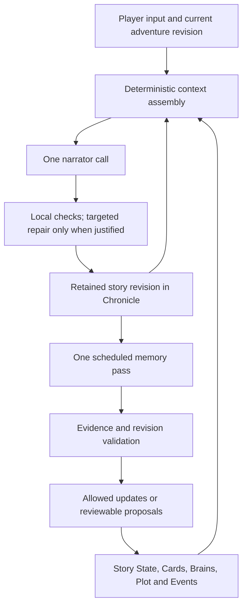

# Storytelling quality first: a revised architecture proposal

> **Status:** Proposal, revision 3 — decision rationale added. No application changes implemented.
> **Audience:** Seth and contributors.
> **Reviewed:** 2026-09-30. Application code: `82321cffab90c4769ecefd30acb60fe2e76371a3`; previous proposal: `83b7eb751ddbbe8198b402c673bea58297a68f0e`.
> **Evidence:** Source review, two read-only save inspections, and actual context-builder output. No paid model evaluations were performed. Proposed behavior below is not current behavior.

## 1. The decision

**Keep one strong narrator and one coordinated memory-maintenance pass. Improve the information they receive, what they preserve, and when their output becomes authoritative. Judge the design by the resulting story.**

The app should feel like a capable collaborator who remembers why things matter, lets characters develop, follows the player's lead, and brings consequences to completion. Accurate dates and relationship labels are necessary, but they are only part of that experience.

The priorities are:

1. **The best story experience:** prose, character voice, emotional and causal continuity, agency, pacing, payoff, and responsiveness to this player's taste.
2. **Good automatic maintenance:** the story's changes reach the appropriate components, cards, and Brains without requiring the player to administer them.
3. **Lower API cost:** remove redundant work and use the least expensive configuration that preserves the desired experience.

This ordering permits spending more on a narrator or a memory pass when it produces a meaningfully better story. It also permits removing an AI call when that call damages good prose. Fewer calls and fewer tokens are useful measurements; neither is the objective.

My recommendation is an evolution of Claude's fixes, with two important additions: **preserve the causal and emotional meaning of events**, and **evaluate the narrator, context, and repair passes separately before deciding which one is the bottleneck**.

## 2. What the first proposal got right—and what I would change

The first proposal identified real reliability risks. Its weakness was treating a reliable memory pipeline as nearly the whole strategy.

| Earlier emphasis | Revised judgment |
|---|---|
| Fix memory, then address narrative quality | Fix known information-loss defects, while diagnosing prose, context, and correction quality in parallel. A flawless store cannot rescue weak narration or destructive rewrites. |
| Preserve current facts | Also preserve motives, causes, obligations, unfinished actions, and relationship turning points. “They trust each other” loses more than “She trusts him because he kept her secret when exposing it would have helped him.” |
| Require review for consequential changes | Consequence alone is the wrong distinction. An unambiguous commitment already made in the story should be recordable under the user's auto-update policy. An invented commitment should not be. |
| Make small structured updates | Apply structure selectively to facts where exactness matters. Keep natural language for voice, meaning, motives, and nuance; do not turn every sentence into a database relation. |
| Preserve deterministic pacing | Preserve the gate, but examine what its counters mean and how an arc becomes complete. A six-turn timer is not evidence that a conflict resolved. |
| Improve retrieval before expanding memory | Also improve what gets retained. Perfect retrieval cannot recover a relationship turning point that was discarded as a temporary conversation. |
| Keep a capable narrator | Actually compare narrator candidates with the same high-quality context. The existing configured model has not been shown to be the quality ceiling. |

The prior document remains available in Git history. This revision replaces its recommendations rather than adding a competing proposal.

## 3. What the app actually does today

The core is already useful: a browser-only app, a central reducer, inspectable context sections, a complete transcript, distinct memory surfaces, optional approval, and provider usage tracking. No backend or distributed agent system is needed for the improvements recommended here.

### The working foundation

- Narration and automatic memory generation are separate. Normal automatic maintenance uses one JSON call, with a default cadence of three story turns.
- The memory call can update Story State, existing Brains, cards, Active Pressure, Current Arc progress, and Plot Essentials through their respective paths.
- Context combines persistent instructions, selected memory, and recent messages. Per-turn material goes near the newest user input.
- Story State and knowledge boundaries address current truth and information access.
- The Arc Director withholds the authored break instruction until its gate opens.
- Auto-approval follows configured policies; it is distinct from generating suggestions. Plot Essentials still require review.
- The provider accounting now includes multiple calls and discarded work when usage is reported.

These findings come from [the runtime](../src/hooks/useAdventureRuntime.ts), [turn pipeline](../src/state/turnPipeline.ts), [context builder](../src/contextBuilder/contextBuilder.ts), [background pass](../src/memory/compactMemoryFallback.ts), [memory contract](../src/memory/onePassMemory.ts), and [usage accounting](../src/providers/usage.ts).

### Important limitations confirmed in code

| Current mechanism | Implication |
|---|---|
| A failed memory pass still advances the message marker | Some unprocessed evidence can leave the next window. Separate attempted work from completed coverage. |
| Pending State contents are not supplied to the next pass; a newer pending State supersedes the older one | Unapproved developments can disappear from subsequent drafts. |
| Non-State pending proposals are deduplicated by type/title/target | Distinct card facts can compete; thought and knowledge proposals for one Brain can compete too. |
| Memory references come from narration's already-selected context | A record relevant to earlier evidence can be unavailable to the maintenance task. |
| Quotes are checked for presence, not semantic support | A real quote can accompany an incorrect inference, speaker attribution, or belief promoted into fact. |
| The continuity checker sees only eight recent messages | It can soften a true older promise, while missing contradictions outside its regex triggers. |
| The agency guard compares second-person action phrases | “I follow her” can still lead to a suspected violation when narration says “You follow her.” Its rewrite receives the input and draft, not full canon. |
| Brains emit live thoughts and knowledge, not legacy `currentState`, `relationshipPressure`, or `recentDevelopments` | A value being saved does not mean the narrator sees it. |
| Trigger matching includes a recent-text window | A mention can influence several turns. It is not proof of present participation or a new plot development. |
| Arc advancement moves Break to Aftermath once six elapsed turns have passed, when advancement executes | Resolution can be a timer effect rather than an established outcome. |
| Current Arc updates append to its log; historical material needs deliberate management | Long-running context can accumulate history that no longer helps the next scene. |
| Automatic memory does not create Event Memory cards | Some distinctive experiences need manual capture or the explicit Chronicle scan. |

Relevant implementations: [proposal application and arc advancement](../src/state/adventureReducer.ts), [continuity lint](../src/continuityLint.ts), [response guard](../src/state/storyResponseGuard.ts), and [event recall](../src/memory/eventMemory.ts). These are confirmed mechanisms; their frequency and impact during play remain unmeasured.

### What two real snapshots show

I normalized two saved adventures with the existing code and ran `buildContext` without making a provider request.

| Observation | Seattle copy, turn 911 | Repaired Seattle, turn 900 |
|---|---:|---:|
| Stored Story Cards | 306 | 28 |
| Cards included in this context, pinned plus triggered | 12 | 16 |
| Estimated total context tokens | 15,369 | 11,693 |
| Estimated tokens for system section plus AI Instructions | 2,777 | 1,356 |
| Estimated tokens for recent messages | 5,762 | 5,008 |
| Story State included | No | Yes |

These are different snapshots, with several simultaneous edits and different recent histories. They are **not a controlled quality comparison or a billing estimate**. The tokenizer is approximate.

They demonstrate why counting saved cards or looking only at settings is insufficient: the repaired snapshot has fewer stored cards but more cards in the actual context, and a smaller overall prompt. Better organization can make more useful information available with less text.

The repaired snapshot also contains nonempty legacy `currentState` text on six active Brains; the builder omits that field. This is not a recommendation to restore the old unbounded field. It is a reason to verify the real provider payload whenever evaluating a memory design.

Evidence files, in the Saves repository:

- `sync/saves/adv_mumc3n18_8aw1nzj1/2026-09-30T08-14-18-428Z-auto.json`
- `sync/saves/adv_seattle_hunger_repaired_20260930/2026-09-30T19-48-51-373Z-manual.json`

## 4. Design principles and why I choose them

### A. Separate creativity from recordkeeping, but share a coherent story

The narrator may introduce an NPC's next action, an obstacle, an image, or an unexpected response within established constraints. The memory worker records the resulting fiction; it should not independently advance events.

The two tasks need different prompts, sampling, output formats, and often different context. A common model is a reasonable initial baseline; a cheaper memory model earns its place through accuracy tests.

**Tradeoff:** a periodic second call and update lag. The benefit is focused narration and a maintenance task we can inspect and evaluate independently.

### B. Remember what will change future behavior

A useful memory answers a future storytelling question: what would this person do, what promise still binds, why does this place matter, what is unfinished, or what must not be contradicted?

Store the cause and consequence when they matter. Preserve a distinctive line or detail when it carries voice or emotional meaning. Routine movement belongs in current scene state, not permanent lore.

**Tradeoff:** salience requires judgment. Avoid rigid rules that discard all conversations or retain every event. An ordinary-looking conversation can contain the story's most important change.

### C. Separate world truth, belief, intention, history, and author direction

“Mira suspects the duke,” “the duke is guilty,” “Mira plans to confront him,” and “Mira confronted him” are different claims. A direction for a future climax is different again.

A character can lie; a player can propose an action without completing it; an NPC can form a mistaken belief. Correct memory preserves these distinctions.

**Tradeoff:** some lightweight labels and source metadata. This is worth more than a single model confidence score, which does not establish truth.

### D. Preserve facts precisely and meaning expressively

Use targeted changes for time, location, relationship status, obligations, and knowledge access. Use concise natural language for character voice, emotional significance, motives, and causal explanations.

Do not require a full replacement of a large block to change one fact. Do not build a universal fact graph before a narrower approach has proved inadequate.

**Tradeoff:** mixed structured and prose representations need explicit ownership. The benefit is avoiding both accidental deletion and sterile memory.

### E. Treat attention as scarce even when context is cheap

Recent dialogue, a live obligation, and a central character's voice may matter more than pages of technically relevant lore. Budget for what enables the next scene, while preserving the archive outside the prompt.

**Tradeoff:** selection can omit something useful. Make omissions explainable and test retrieval, rather than assuming a large context window solves the problem.

### F. Automate established changes; surface unresolved ambiguity

The player should be able to play without repeatedly approving that the characters arrived at a location or learned something in dialogue. A major event already established in the fiction is not inherently less recordable than a minor one.

Review is useful for ambiguous identity, contradictory evidence, destructive replacement, foundational premise changes, and user-selected approval policies. Existing protected authoring surfaces remain protected.

**Tradeoff:** automation can make mistakes. Source links, reversible updates, revision checks, and selective review make that risk manageable without turning the game into clerical work.

### G. Let code guarantee mechanics; evaluate AI interpretation

Code can guarantee that a stale replacement does not overwrite a newer revision. It cannot prove that “she smiled” means “she forgave him.”

Use deterministic validation for identity, permitted writes, source existence, coverage, revision conflicts, and budgets. Evaluate semantic accuracy with difficult examples. Do not label a valid JSON response “correct memory.”

### H. Optimize the whole session

A smaller request that causes three corrections is not a successful optimization. Neither is a stronger model whose better prose is subsequently flattened by a weak rewrite.

Measure story quality, correction burden, latency, and total paid work together. Keep separate measurements so an improvement in one cannot conceal a serious regression in another.

## 5. The proposed architecture

Keep the existing visible surfaces. Improve the data flow through them.

This is a proposed steady-state flow, not a claim that the current implementation provides all the checks shown. User-configured semantic rules remain supported; their writes should obey the same revision and conflict rules rather than become an independent last-writer-wins path.

There is no default planner call, per-character call, or critic call. If a later experiment proves that a scene-level planning call materially improves quality, it can be added at that boundary with an explicit cost budget.

### The narrator's context should answer six questions

1. What did the player just attempt, say, or explicitly authorize?
2. What is physically happening now, including any unfinished action?
3. Who is involved, how do they speak, and what do they want?
4. What does each relevant character know, believe, or misunderstand?
5. Which earlier cause, promise, relationship event, or constraint matters here?
6. What is the current narrative pressure, and where is a natural opening for the player to act?

These answers should come from the existing sections, not a new hidden mega-summary. Context selection can be deterministic; authoring the underlying memory still uses AI.

Preserve player agency without freezing the story. If the player says “we travel to the city,” narrate the authorized transition. If they merely receive an invitation, leave the choice open. “One playable beat” is useful guidance, but it should not force every response to stop before anything happens.

Treat voice examples, behavioral motives, and unresolved relationship tensions as useful input. “Sarcastic and loyal” is less actionable than a short example of how a character jokes when afraid and what they refuse to concede.

### Pacing should create opportunities and recognize endings

Preserve the authored break gate and deterministic engagement policy. However, matching a name across recent text is a coarse proxy for engagement, and multiple selected IDs can accelerate it.

Improve the counted signal before adding an AI pacing judge: distinguish current-turn interaction from repeated historical mentions, and avoid counting several representations of one interaction as several dramatic developments.

Most importantly, opening a climax and completing it are different events. **Elapsed turns should not be treated as proof of resolution.** The existing manual Resolve control is a sound authority for explicit completion. A memory pass could propose that resolution occurred, with evidence, without directly advancing the phase.

Changing automatic resolution requires a deliberate revision to the current pacing contract and tests. Do not introduce an unrestricted model verdict that decides whether the story is “dramatic enough.” Arc continuation should follow an actual ending and respect the user's continuation preference; a finished conflict need not reveal an automatic higher villain.

## 6. What good context updates look like

### Maintain one small record of what changed

Within the existing memory request, identify meaningful changes and route them to their homes. The returned updates should carry:

- The stable target identity, operation, and target revision.
- The actual source message ID or IDs and a short supporting excerpt.
- Whether the statement is an established fact, character belief, intention, or explicit author correction.
- The old value being superseded, when applicable.
- A concise reason the change matters for later play.

This does not require exposing private chain-of-thought. It is inspectable evidence and update metadata.

**Use targeted operations selectively:** add a durable fact; supersede a specific current fact; mark a thread resolved; append a distinct historical event; update a relevant knowledge boundary. Full replacement remains reasonable for a one-sentence Active Pressure or a small block whose unchanged fields can be checked.

Preserve existing IDs and free-text authoring. A schema change should begin with the most failure-prone State/knowledge fields, not a wholesale migration of every saved sentence.

### Match the maintenance context to the maintenance task

Give the worker all unprocessed source messages within an explicit token budget, the current values of relevant targets, relevant identities/aliases, and applicable constraints. It should see records mentioned anywhere in that evidence window, even if they were unnecessary for the newest narrator prompt.

Show pending changes as pending, with their original evidence. They are drafts to reconcile, not new evidence or approved truth. Keep them out of narrator context until applied.

Split a backlog chronologically; preserve the cursor for unread material. An output ceiling must not silently mean “forget everything after update twelve.” Differentiate complete scanning, deferred work, and rejected changes. Do not endlessly retry a claim deliberately rejected as unsupported.

### Preserve enough meaning for each surface

| Surface | Retain | Avoid |
|---|---|---|
| Story State | Current scene, arrangements, relationship status, active constraints, immediate unresolved actions; as-of revision | An exhaustive lifelong list of every meeting or event |
| Story Cards | Stable identity/voice and durable subject facts; why important bonds or commitments exist | Repeated daily recaps or contradictory living facts |
| Brains | Relevant knowledge, current beliefs and intentions, meaningful private reactions | Treating every old thought as a current intention; granting unseen knowledge |
| Current Arc | Active premise, completed causal developments, unresolved stakes, evidence of progress | An indefinitely growing transcript or invented progress |
| Active Pressure | The live external force, or its explicit resolution | Manufacturing a new danger merely to fill the field |
| Plot Essentials | The compact story foundation and durable constraints | Updating the premise after ordinary scene changes |
| Event Memory | A completed, distinctive turning point with cause, consequence, participants, source, and recall cues | Every pleasant conversation; a recap duplicated across all surfaces |
| Chronicle | The source transcript, with edits handled through existing controls | Using the entire archive as the default narrator prompt |
| AI Instructions / Author's Note / Next Output Bias | Author-owned rules, tone, and temporary steering | Autonomous rewriting by maintenance |

For Brains, first improve what current thoughts and knowledge contain. If a separate bounded “current intention” view proves necessary, add a visible, tested field. Do not silently revive legacy fields that the current builder intentionally excludes.

A private reaction can involve interpretation. “Mira suspects betrayal” can be a character belief grounded in persona and recent conduct; it must not become proof that betrayal occurred. Inferred interiority must not create new witnessed events, abilities, or secret knowledge.

A 250-word State block and 90-word knowledge block cannot grow with the entire adventure. Retain current essentials there; keep historical meetings and durable facts in retrievable records. Knowledge boundaries should focus on consequential secrets and access, not enumerate everything a character does not know.

### Preserve emotionally important events automatically, selectively

The current background pass excludes event recaps and cannot create Event Memory cards. That avoids clutter, but can lose the reason a bond feels earned.

I recommend a later, narrow extension: allow the existing pass to propose exceptional completed events, using the existing Event Memory surface and mandatory review required by current policy. Prioritize revelations, costly choices, broken promises, first meetings that matter, and recurring personal symbols.

This is an explicit policy change, not current behavior. Start with few candidates and measure useful later recall. Storage alone is insufficient; verify that natural cues retrieve the event without forcing constant callbacks.

### Make related updates consistent

An established breakup may update current relationship status, supersede a living-card fact, and change a Brain. Those are several views of one development.

Keep source linkage across them. Apply compatible changes against current revisions; defer stale or conflicting ones. One invalid update should not discard all unrelated valid changes, but the app should not silently apply an incoherent subset of a dependent change.

Review should merge distinct pending additions and preserve thought and knowledge updates separately. Approving a draft weeks later must not erase intervening user edits.

### Example: intention, commitment, and knowledge

Suppose the player says, “I might stay at Mira's tonight.” Mira says, “The room is yours if you want it.”

At this point:

- No move-in or sleeping arrangement is established.
- A standing offer may matter; the conditional wording must survive.
- Mira knows the offer was made. An absent friend does not automatically know.
- A plausible private hope is a belief or desire, not a completed event.

Later the player explicitly accepts and the scene establishes a continuing arrangement. State records it; a living record can retain its duration and terms; a major relationship turning point may justify an event. Plot Essentials probably remain unchanged.

The distinction between an offer, tonight's stay, and moving in matters more than how many updates the worker produces.

## 7. Freshness, authority, and correction

Periodic memory can work because recent prose supplies the immediate bridge. It fails when the bridge disappears or stale State is presented as timeless authority.

**Proposed rule:** every derived snapshot states what source revision it covers. Established changes after that point take precedence for the affected facts. Newer text is not automatically more authoritative: dialogue can contain a lie, an attempted action can fail, and a narrator can contradict explicit canon.

Explicit author corrections should persist through a dedicated reconciliation path and remain distinguishable from events inside the story. Ordinary OOC discussion should not become an NPC memory. The current runtime skips automatic memory after OOC turns; a later window may happen to include them, but that is not a dependable correction mechanism.

Regeneration, deletion, and editing must invalidate or recheck affected derived memory using source provenance. Queuing asynchronous actions is not enough; replacements also need a revision check at application time.

**Proposed coverage invariant:** before unprocessed story text leaves the working context, either maintenance has accounted for it or the system exposes the gap and retains enough source for recovery. A rare bounded catch-up or wait is preferable to silently skipping important events. This is a design target, not a guarantee the current code provides.

Keep cadence three as a baseline, not a sacred number. Change it only with evidence about freshness, loss, cost, and latency. Important knowledge acquisition should not inherit a cooldown intended to suppress repetitive thoughts.

## 8. Repairs must earn their place

The output pipeline can pay for narration, then an agency/length rewrite, then continuity lint. Each transformation can also weaken voice or remove valid facts.

Evaluate all three outputs separately. Record why a repair fired and whether a human prefers the result. Improve the detector before paying for more repairs.

For a justified continuity repair, supply relevant established canon and distinguish:

- A contradiction of established truth.
- A retroactive claim with insufficient support.
- A legitimate new event or NPC action.
- An unresolved fact that should remain uncertain.

A new arrival is not wrong simply because it was absent from previous messages. A previously established promise is not wrong because its evidence is older than eight messages.

Use the smallest correction that fixes the problem. Include voice constraints and necessary canon. Recheck the final output locally; combine agency and continuity issues into one repair request when they are known together, rather than repeatedly rewriting the prose.

A small length overrun should be evaluated against the user's chosen limit and experience; changing hard-limit behavior would be a product decision. Do not simply disable the guard or truncate good prose mid-sentence.

## 9. Spend less by removing waste before lowering capability

### Model and generation settings

Test a stronger narrator against the current one. Also test the current narrator with better context. This distinguishes model limitations from information problems.

Initially use a competent memory model with a bookkeeping-specific profile: lower sampling variability, no novelty incentive, and enough output capacity for the requested schema. The background resolver currently inherits narrator settings. The pass ceiling is `min(maxOutputTokens, 2000)`; the factory maximum is 1,200, so 2,000 is not guaranteed.

If a cheaper memory model passes the difficult extraction and preservation tests, use it. A bad persistent update can affect many later turns, so JSON compliance alone is not enough. Keep voice-consistent narration across ordinary turns; frequent model switching should also be tested for style discontinuity.

### Context budgets

Retain enough raw recent dialogue for natural continuation. Reduce duplicated instructions, obsolete state, repeated thoughts, and irrelevant memory before reducing that history.

The default `userLocked` budget policy can drop older recent messages before memory. That may be exactly what an author wants, but it should not be assumed best for conversational flow. Propose a minimum coherent recent exchange/scene allowance, subject to explicit protected-context constraints. Report when protected material prevents it from fitting.

Do not pick a universal token budget by intuition. Compare actual payloads and outcomes. Section estimates also differ from billed provider tokens and must leave room for output.

### Caching

Maintain stable serialization and useful prefix reuse. The current prefix still contains evolving Active Pressure, arc progress, and pinned living cards, so it is not entirely stable. First eliminate redundant updates; then consider separating stable identity/premise from frequently changing values.

That separation would change the repository's fixed context-order contract and must be proposed and tested explicitly. Fresh facts must never be withheld to preserve a cache hit.

Provider behavior differs: DeepSeek describes best-effort prefix caching; Anthropic supports explicit and automatic cache boundaries. The current adapter's system breakpoint does not establish that all later history is cached. Measure returned usage, rather than promise a fixed discount. [DeepSeek documentation](https://api-docs.deepseek.com/guides/kv_cache/), [Anthropic documentation](https://platform.claude.com/docs/en/build-with-claude/prompt-caching).

### Frequency and total cost

For a long run, the approximate scheduled baseline is one narrator call per turn plus one memory call per three turns. Add repair calls, user-defined semantic work, regeneration, arc continuation, and manual tools.

Changing cadence from three to five reduces scheduled memory calls by about 40%, but increases each evidence window and update delay. It does not imply 40% lower total cost. Do not add a separate AI call just to decide whether the memory call is needed.

Track cost by request purpose and model, with input/output and cache categories interpreted according to provider billing. Missing usage remains unknown. Include paid failures and discarded work.

Report **cost per 100 retained turns alongside quality, correction count, latency, and player maintenance time**. A retained turn is not automatically a satisfying one; human judgment remains necessary.

## 10. How to decide what actually improves quality

### First diagnose the bottleneck

Use a small set of representative checkpoints: tense dialogue, action, a relationship change, a long callback, a secret, and an arc climax. Hold the player action and allowed evidence constant.

| Experiment | Narrator | Context |
|---|---|---|
| A | Current | Current builder |
| B | Current | Human-curated context from the same available evidence |
| C | Stronger candidate | Current builder |
| D | Stronger candidate | Curated context |

Curated context must not leak future events or hidden break instructions. Preserve scenario intent. Use repeated samples and blind preference where practical.

- B improving on A suggests selection/representation is a bottleneck.
- C improving on A suggests model capability matters.
- D alone improving substantially suggests both matter.
- Good drafts becoming poor final outputs implicates repair passes.

This is a small diagnostic comparison, not a statistically conclusive model ranking or proof of a universal winner. No such provider experiment was run for this document.

### Test memory separately

Build expected changes from known source windows. Measure omission, unsupported additions, wrong subject, wrong time, lost unchanged facts, knowledge leakage, duplicate proposals, and correct no-op behavior.

Test failures and edits too: invalid JSON, truncation, delayed approval, multiple facts for one target, late asynchronous results, regeneration, OOC retcons, and long pauses.

Keep source coverage and semantic completeness separate. Code can prove it supplied every message; it cannot prove the model noticed every meaningful detail.

### Then test closed-loop play

Single-turn comparisons miss memory feedback. Run selected configurations through multiple scenes and enough turns for earlier evidence to leave recent context. Include quiet scenes, unresolved obligations, returning characters, and a real ending.

Assess:

- Is the prose enjoyable and the voice distinctive?
- Do NPCs behave consistently while still changing?
- Do past choices cause later consequences?
- Can the player move the story without directing every beat?
- Do corrections stay corrected?
- Are promises and emotional turning points recalled appropriately?
- Do arcs resolve without forced sequels or abrupt timer endings?
- How much editing, review, and regeneration does the player do?
- What are the total spend and response delays?

Do not reduce these to one averaged score that hides a serious continuity failure. Keep a small regression set plus longer play; local unit tests cannot establish literary quality.

## 11. Recommended order of work

| Priority | Work | Why first |
|---|---|---|
| 1 | Capture actual narrator context, raw draft, repairs, memory changes, and request costs on representative checkpoints; run the model/context comparison | Determines what limits the experience before committing to a large redesign |
| 1, alongside diagnosis | Repair failed-pass coverage, pending-change loss, stale replacements, and correction provenance | These are known information-integrity defects, regardless of model choice |
| 2 | Improve narrator instructions, scene-context selection, and repair precision; distinguish arc completion from elapsed time | Directly improves prose, agency, and narrative payoff |
| 3 | Improve memory semantics: causal facts, knowledge access, targeted updates, consistent routing, bounded character intentions | Makes automatic updates help future writing instead of merely producing more records |
| 4 | Add selective event capture and better cue/alias retrieval if long-term callbacks remain weak | Preserves and retrieves the moments that make a long story feel personal |
| 5 | Tune sampling, output capacity, cache layout, cadence, and cheaper model candidates against the established quality bar | Reduces measured waste without guessing what the story can afford to lose |

Some diagnosis uses current controls; schema, scheduling, context-order, and phase-transition changes require implementation later. This document does not authorize applying them to existing adventures or rewriting saves.

## 12. Alternatives considered

| Alternative | Decision and tradeoff |
|---|---|
| Put the entire Chronicle into a huge context | Useful as an offline comparison on bounded excerpts, not the default design. Repetition, contradictions, cost, and attention remain concerns. |
| Make the narrator emit prose plus all memory every turn | Keep the current separation. This changes the narrator's task and expands every response; reconsider only if direct testing shows a clear advantage. |
| Add a planner and critic every turn | Do not make this the baseline. Extra calls must demonstrate a quality gain that survives latency and cost. A scene-boundary trial remains reasonable. |
| Require manual approval of everything | Unsuitable as the intended play experience. Preserve the user's controls, but improve automatic handling of established changes. |
| Automatically accept all memory | Unsupported inference becomes persistent canon. Use evidence, revision checks, and selective review. |
| Build a full knowledge graph or vector database immediately | Premature. Start with existing surfaces and inspectable selection; adopt semantic retrieval only for demonstrated misses. |
| Always choose the cheapest memory model | Reject as a default assumption. Errors can propagate across many turns. |
| Restore every legacy Brain field to context | Reject. Define a bounded visible representation for demonstrated needs instead of restoring past context growth. |

## 13. Research context and limits

These sources inform evaluation questions, not a claim that a research architecture is optimal for this app:

- [LongMemEval](https://arxiv.org/abs/2410.10813) separates extraction, temporal reasoning, knowledge updates, multi-session reasoning, and abstention. That supports testing memory capabilities separately rather than equating a larger context with reliable memory.
- [Generative Agents](https://arxiv.org/abs/2304.03442) evaluates observation, reflection, and planning in believable agents. It motivates preserving useful interpretation and intentions; its simulation results do not establish that this app needs a separate planning call every turn.
- [Lost in the Middle](https://arxiv.org/abs/2307.03172) documents sensitivity to information placement in the models/tasks it tested. It is a reason to evaluate actual context use, not a timeless claim that larger contexts are always worse.

Repository behavior is grounded in source inspection. The token comparison is a deterministic local measurement. Narrative gains, model rankings, and dollar savings remain hypotheses until evaluated.

## 14. Decision rationale and what would change the recommendation

### Why I start with the experience rather than the architecture

Your first objective is the best possible interactive story. That does not translate directly into “largest model,” “most memory,” or “most AI passes.” Each can help, but each can also introduce delay, irrelevant context, or conflicting decisions.

I therefore judge a mechanism by its effect on scenes and on a continuing adventure. Reliability is a necessary foundation; it is not a substitute for voice, emotional movement, or satisfying consequences. This is why the roadmap combines immediate integrity fixes with narrative diagnosis rather than postponing all creative evaluation until a memory redesign is complete.

There is no specified spending ceiling here. I would not quietly sacrifice quality to reach an invented price target. The useful result is a measured choice: what quality a configuration delivers, what it costs, and what extra spending actually buys.

### Why the proposed division of work fits this codebase

The narrator's output should be an engaging continuation. The memory worker's output should be a faithful, usable account of what changed. They can use the same capable model while receiving different instructions and settings.

The repository already implements this separation, so retaining it avoids discarding useful controls and tests. That is an implementation advantage, not proof that the design is optimal. A combined narration-and-memory response would deserve reconsideration if matched experiments showed better prose, dependable updates, and a worthwhile reduction in total cost.

Likewise, “one coordinated writer” means consistent application rules. It does not mean one enormous prompt that reads every record, nor does it eliminate explicitly configured semantic automation.

### Why memory accuracy has disproportionate value

A bad sentence can spoil one response. A bad memory can shape many later responses.

Suppose an offer becomes “they moved in together.” Later narration repeats that arrangement. A subsequent memory pass quotes the repetition, and the original mistake starts to look corroborated. Repetition of the same unsupported assertion is not independent evidence.

Source lineage and corrections matter because they let the app trace that chain back to the originating claim. This is the reason for actual source IDs, distinctions between fact and belief, and rechecking memory after edits. It is also why a cheaper memory model must demonstrate semantic accuracy, not merely valid formatting.

Missing memory matters too. A system that avoids all unsupported additions by recording almost nothing will lose promises, motives, and earned intimacy. Evaluation must measure both false additions and important omissions.

### Why causal memory needs restraint

Remembering why a character trusts someone gives the narrator material for a specific reaction. However, converting that history into “she must always trust him” would freeze the relationship.

Historical causes should inform behavior without prescribing every future response. Current beliefs can change; intentions can be abandoned; resolved obligations should stop generating pressure. The system should preserve the earlier event while updating what it means now.

That is why this proposal separates history, current state, and character perspective. The purpose is to support believable development, including surprising development, rather than enforce permanent personality snapshots.

### Why I do not prescribe one model, budget, or cadence yet

The local review established what the code sends and how it handles updates. It did not establish which available model writes the best story for you, how much recent context is sufficient, or how frequently memory should run.

The model/context comparison is useful because it tests competing explanations. If better context fixes the current narrator, a model upgrade alone misses the main opportunity. If strong context still produces weak prose, more memory machinery is unlikely to solve it. If the raw draft is good and the repaired version is worse, the intervention should target the repair path.

These experiments should use bounded offline checkpoints first. They do not require adding an evaluator call to every live turn.

### Confidence and conditions for changing direction

| Recommendation | Basis for the choice | Evidence that would change it |
|---|---|---|
| Fix coverage, pending-change loss, and stale writes | Directly observed mechanisms can lose or overwrite information | A changed implementation that closes those paths; no model benchmark is needed to justify the integrity requirement |
| Keep separate narration and memory | Existing architecture supports distinct objectives and independent evaluation | A combined design consistently produces equally good stories and updates with lower total burden |
| Prefer concise causal memory | It preserves material that can explain distinctive later behavior | Controlled play shows more repetition or less useful recall than a simpler representation |
| Keep repair calls selective | The current repair paths have limited evidence and can alter correct prose | Broader checking demonstrates a clear net quality gain with acceptable delay and cost |
| Delay a vector store or full fact graph | Current storage/selection defects offer nearer, testable improvements | Correctly stored important memories remain unretrievable with practical alias/cue methods |
| Use three turns only as a baseline | It is the existing default, with a plausible recent-history bridge | Measured freshness, omission, or cost favors another interval or a bounded adaptive policy |
| Avoid per-turn planning by default | Its benefit has not been demonstrated here | Blind comparisons and longer play show better agency, pacing, and payoff that justify the additional request |

The strongest conclusions concern information integrity and the need to evaluate the actual provider payload. The proposed gains from causal memory and selective repairs are reasonable design hypotheses. Specific model rankings, dollar savings, and optimal settings remain open.

**The proposed destination is a strong storyteller with a concise, current, causally meaningful working memory, reliable long-term recall, and little administrative burden on the player. The next step is to find which part of the current experience most limits that outcome, while closing the information-loss paths already visible in code.**
